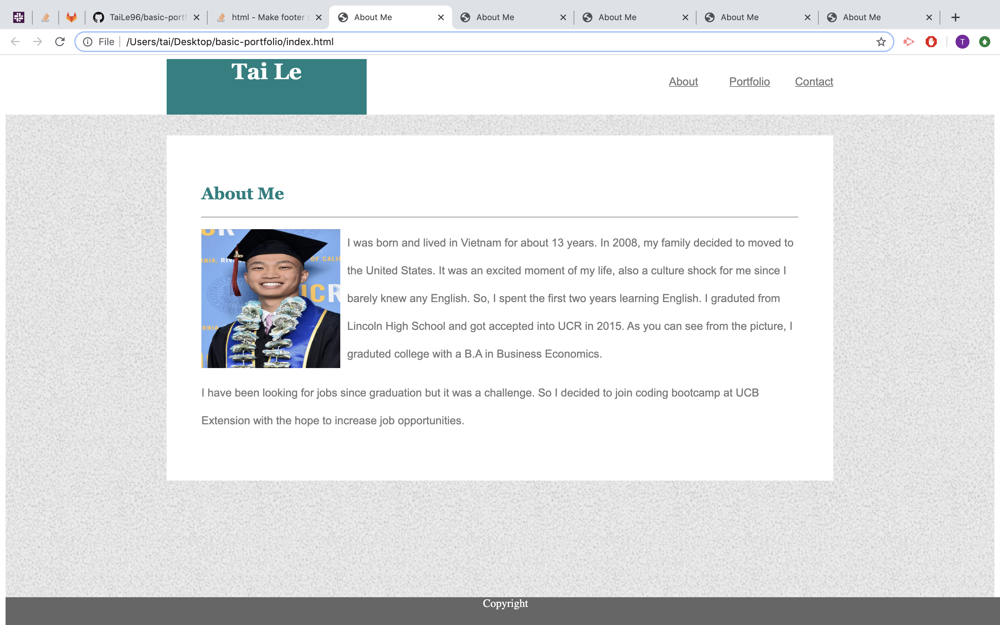
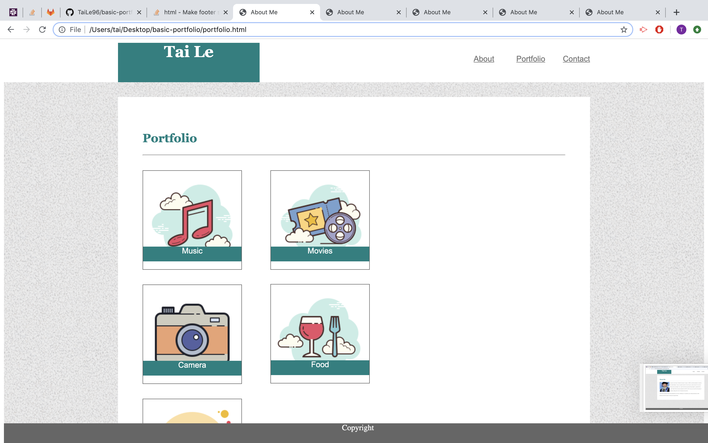
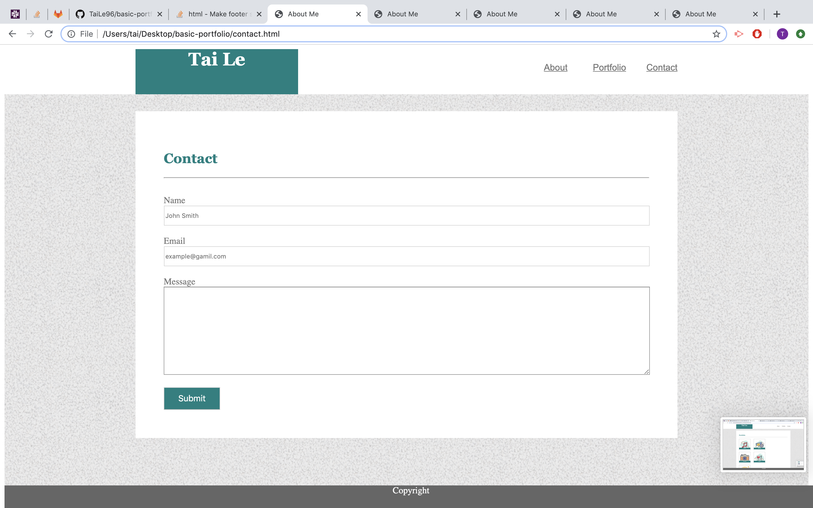

# About Me

## Site Picture





## Technologies Used
- HTML - used to create elements on the DOM.
- CSS - used to style the elements in HTML.
- Git - used to track, commit, and push changes.
- GitHub - used to publish the page.
- Class - used to style a specific elements in HTML.
- Position and float - to adjust the flow of the HTML.

## Summary
This page contains the information about me, portfolio. contact and message.

## Code Snippet
```html
<div id="box">
    <div class="wrapper">
            <div>
                <h2>Portfolio</h2>
                <hr>

            </div>
            
            <div class="image1">
                
                    <div class="img-banner">Music</div>
            </div>
                
            <div class="image1">
                
                    <div class="img-banner">Camera</div>
            </div>

            <div class="image1">
                
                    <div class="img-banner">Cars</div>
            </div>

            <div class="image2">
                
                    <div class="img-banner">Movies</div>
            </div>
            
            <div class="image3">
                
                    <div class="img-banner">Food</div>
            </div>

    </div>
```
This code helped wrap all the important information inside the main content box.

## Author Links
[LinkedIn](www.linkedin.com/in/tu-tai-le-2a9646139)
[GitHub](https://github.com/TaiLe96)
